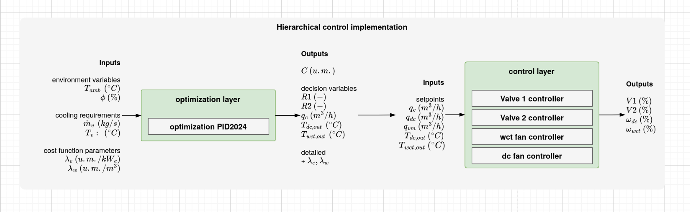

# Thesis title

## How to use


## Compile Document

```
latexmk -lualatex main.tex
```

## LaTeX settings

This thesis is done in LaTeX using the [kaobook class]() with some modifications
inspired by... In particular:

(Fill here all the changes and which files have been changed)

- TODO Changed colors for paragraphs in the margins (margin@par) to a lighter gray (`kao.sty`)
- TODO Changed font to Fira Sans, as used in TheoWinterhalter-PhD (`main.tex`)
- Changed side citations to a dark gray, as used in TheoWinterhalter-PhD (`main.tex`)

## Environment

Most of 

thanks to [Paul Wintz](https://paulwintz.com/latex-in-vscode/)

## TODOs

- [ ] Añadir List of open-source software used. Not an extensive list but the
  main ones.
- [ ] Add \listofcontributions
- [ ] Glosary is not being printed
- [ ] Mirar la posibilidad de incluir citas en páginas en blanco entre
  capítulos
- [ ] Caja TL;DR para inicio de cada capítulo


Si finalmente se hace un capíutlo de instalaciones experimentales, se puede
hacer una introducción donde se ponga esta imagen con marcas:


Indicando el campo solar, el circuito de intercambio, generación de vapor,
refrigeración combinada, etc. y la MED


