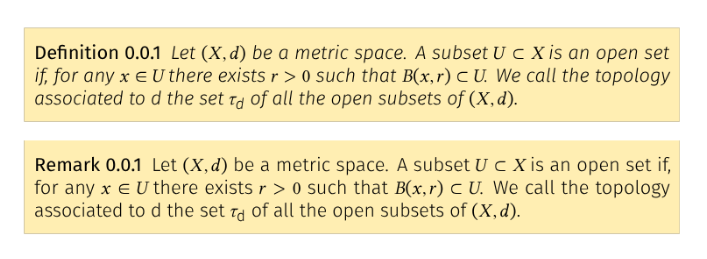
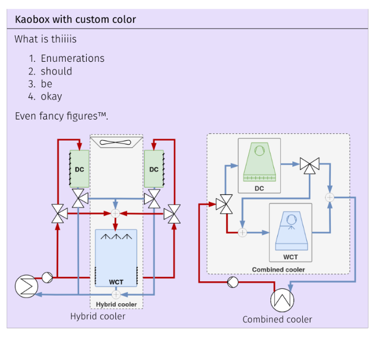
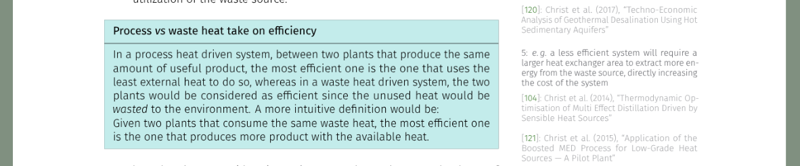
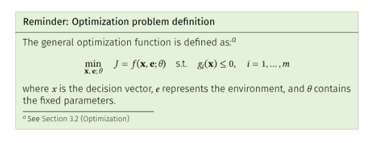
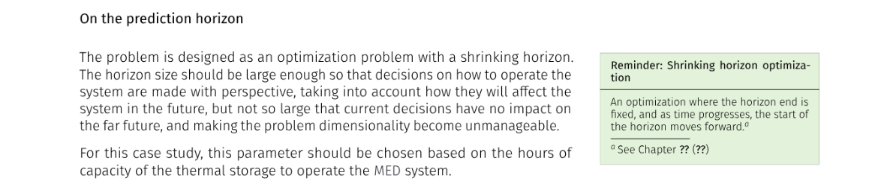

[](https://doi.org/10.5281/zenodo.17885527) [](https://orcid.org/0000-0001-8908-0323)  

# Towards optimal resource management in solar thermal applications: CSP and desalination

> [!NOTE]  
> Spanish title / Título en español: **Contribuciones a la gestión óptima de recursos en aplicaciones solares térmicas: CSP y desalación**

**Author:** Juan Miguel Serrano Rodríguez  
**Institution:** University of Almería  
**Degree:** Computer Science PhD Thesis  
**Year:** 2025

**Supervisors:**  
- Dr. Lidia Roca Sobrino [](https://orcid.org/0000-0002-8724-5136)
- Dr. Patricia Palenzuela Ardila [](https://orcid.org/0000-0001-8044-969X)


**Keywords:** CSP, cooling, desalination, solar thermal energy, resource management, optimization 

---

This research encompasses two complementary studies on two intrinsically linked resources: water and energy. The first part focuses on the efficient management of water resources for power generation, while the second explores the efficient use of solar energy for clean water production.

**Concentrated Solar Power (CSP)** is poised to be a crucial contributor to the energy transition away from fossil fuels. The first phase of this transition is well underway, driven by the massive deployment of low-cost and non-dispatchable renewable technologies such as wind and solar photovoltaics. However, the second and more challenging phase, which involves achieving large-scale dispatchable renewable generation, is still ahead. CSP stands out as a renewable and scalable dispatchable technology with the potential to outcompete combined-cycle and coal-fired power plants.

One of the key challenges in CSP systems lies in cooling the power block, which is typically associated with high water consumption. The first part of this research is therefore dedicated to the efficient management of water resources in CSP plants. An optimal water management strategy is proposed for CSP systems that integrate novel combined cooling configurations. To this end, the annual performance of different cooling alternatives is evaluated for a commercial 50 MWₑ CSP plant, Andasol-II, located in southern Spain. Specifically, three cooling systems, all modelled and validated, are compared: the plant’s existing wet cooling tower, and two variants of a novel combined cooling system with dry cooler capacities of 75% and 100% of the nominal thermal load of the wet cooling tower.

For each alternative, plant operation is optimized under the same water-scarcity scenario using a multi-stage optimization framework. This framework minimizes the cooling cost, encompassing both electricity and water expenses, while ensuring that the cooling demand is satisfied. The key challenge lies in effectively managing the limited water resource. Results show that the integration of the combined cooling system can reduce specific cooling costs by up to 80% and annual water consumption by about 48%, with 38% savings during the driest months. These benefits arise primarily from reduced reliance on costly alternative water sources. The combined cooling alternatives also provide more stable and cost-effective operation throughout the year compared to the wet cooling tower, which is highly sensitive to water availability.

**Thermal desalination**, particularly multi-effect distillation (MED), can play an important role in mitigating water scarcity. These systems use thermal and electrical energy to separate seawater or contaminated feedwater into fresh water and concentrated brine. Although it may not become the dominant desalination technology, it is well suited for specific applications. Its competitiveness can be improved by leveraging opportunities such as brine mining or industrial wastewater treatment, which enhance both economic feasibility and environmental benefits.

To expand their applicability, MED systems must improve in two directions: (i) by enhancing efficiency through wider operating ranges, or (ii) by adapting to low-temperature applications in which their heat demands can be partially or fully met using low-exergy sources such as waste heat or solar thermal energy. However, the true cost of thermal energy, and consequently the performance of such systems, is often difficult to quantify, particularly because there is no unified set of criteria for evaluating their performance.

To address this challenge, this research proposes a standardized methodology for evaluating the performance of MED processes, which can also be extended to other thermal separation technologies. The method covers key aspects such as instrumentation requirements, process control, and the suitability of performance metrics. It also includes uncertainty quantification and an algorithm for automatic steady-state detection. The proposed approach enhances the reliability and robustness of experimental evaluations under variable conditions. Experimental results confirm that the methodology is both reliable and consistent, enabling fair comparisons of MED systems across different operating scenarios.

The experimental campaign includes evaluations at high top brine temperatures. Results analyzed using several performance metrics and scale formation risks demonstrate that the MED process can operate at high temperatures without significant scaling and can achieve higher concentrations. However, no substantial improvements in thermal performance or reconcentration capacity are observed unless specific design modifications are introduced.

Finally, a novel operational strategy is proposed to enable the seamless, autonomous, and optimal integration of a solar-driven MED system. The method explicitly determines when to start and stop each subsystem while considering a two-day prediction horizon. This allows the optimization to account not only for immediate performance but also for the effect of present decisions on future production. The approach is based on an experimentally validated system model that includes the electrical consumption of each component, combined with the most comprehensive data-driven MED model currently available in the literature. The control architecture follows a hierarchical three-layer structure, in which the upper operational layer solves a mixed-integer nonlinear programming problem aimed at maximizing water production while minimizing operating costs. Results from a week-long system simulation are compared with two alternative strategies, a baseline rule-based operation and a fixed-schedule optimized operation. The proposed method significantly increases system performance by 32% relative to the heuristic baseline and by 21% relative to the fixed-schedule strategy. These gains arise from the method’s ability to fully exploit the temporal flexibility provided by thermal storage while accounting for operational costs.

## How to use

The best way to interact with the document is via a `devcontainer` and using the
provided workspace. Following the _following_ steps:

1. Clone or download the repository
2. Open it with VSCode
3. Reopen in devcontainer (requires Docker)
4. Open workpsace
5. That's it! Try building the PDF (the build gets automatically triggered after
   every save)

Most of the writing environment customizations were done following a [guide from Paul Wintz](https://paulwintz.com/latex-in-vscode/)

There are a lot of snippets for including attachments in the document, make sure
to check them out in [latex.code-snippets](.vscode/latex.code-snippets).


## Usage tips

- Compile only the parts you are working on, otherwise the build time will be
  significant. 
- The glossary compilation is very buggy (`You can't use a prefix with begin-group character {'.<to be read again> {`). So it's better to leave that part
  commented out in the `main.tex`: `printunsrtglossary`. Generate the manuscript
  PDF, then comment everything else and uncomment the glossary part, and compile
  again. Join both PDFs where it should be appearing and hopefully hyperlinks
  will still work (spoiler it does not).
- Important! Validate the [CITATION.cff](./CITATION.cff) using `uvx cffconvert --validate`. Otherwise, Zenodo will not be able to parse it and
  break the integration.
- Check the [.zenodo.json](./.zenodo.json) file to make sure all the metadata is correct
  before uploading a new version to Zenodo. This file is used by Zenodo to
  populate the repository metadata.

## Cheatsheet

| Command                   | Description                                                                    | Example Output                                   |
| ------------------------- | ------------------------------------------------------------------------------ | ------------------------------------------------ |
| `\glsentrylong{label}`    | Prints the **long form** of the entry.                                         | *Solar Thermal Collector*                        |
| `\glsentryshort{label}`   | Prints the **short form** (abbreviation).                                      | *STC*                                            |
| `\glsentryfull{label}`    | Prints the **long (short)** form.                                              | *Solar Thermal Collector (STC)*                  |
| `\glsentryname{label}`    | Prints the **name** field (if defined separately).                             | Depends on entry                                 |
| `\glsentrytext{label}`    | Prints the **text** field (generic, for non-acronyms).                         | Usually same as long form                        |
| `\glsentrydesc{label}`    | Prints the **description** field.                                              | *A solar device that collects thermal energy...* |
| `\glsentrysymbol{label}`  | Prints the **symbol** field.                                                   | *α*, *Q̇*, etc.                                  |
| `\glsentryplural{label}`  | Prints the **plural form** (uses `longplural` if defined, otherwise adds ‘s’). | *Solar Thermal Collectors*                       |
| `\glsentrylongpl{label}`  | Plural form of `\glsentrylong`.                                                | *Solar Thermal Collectors*                       |
| `\glsentryshortpl{label}` | Plural form of `\glsentryshort`.                                               | *STCs*                                           |
| `\glsentryfullpl{label}`  | Plural form of `\glsentryfull`.                                                | *Solar Thermal Collectors (STCs)*                |
| `\glsentrytextpl{label}`  | Plural form of `\glsentrytext`.                                                | (Depends on definition)                          |


## Compiling the document

The document is compiled using `latexmk` which uses the configuration file
`latexmkrc`. This file in turn uses `lualatex` as the interpreter. Output build
files including the [manuscript PDF](./out_dir/main.pdf) are saved in the [out_dir](./out_dir/) folder.

This build process is defined as a "recipe" in LaTeX workshop, and as the
default in the devcontainer.

## Utility scripts for PDF analysis and B&W conversion

When ordering printed copies of the thesis, it is often more economical to
print black & white (B&W) pages at a lower cost than color pages. However, many
pages that appear to be B&W may still contain small amounts of color
information, leading to higher printing costs. Two utility scripts are provided
to analyze and optimize PDF files for printing:

> [!NOTE]
> These scripts require Ghostscript and Python 3.7+ to be installed. If using
> the provided [devcontainer](#how-to-use), these dependencies are already included.

### Analyzing page colors (Shell script)

The bash script [`count_and_enumerate_bw_pages.sh`](./scripts/count_and_enumerate_bw_pages.sh) quickly analyzes a PDF to identify which pages are black & white vs. color:

```bash
bash scripts/count_and_enumerate_bw_pages.sh out_dir/main.pdf [threshold]
```

**Parameters:**
- `out_dir/main.pdf`: Path to the PDF file to analyze
- `threshold` (optional): Color threshold for C+M+Y ink coverage (default: 0.005)

**Example output:**
```
B&W pages: 95
  Pages: 2,5,6,8,9,10,11,12,...

Color pages: 153
  Pages: 1,3,4,7,25,27,28,...

Threshold (C+M+Y): 0.005
```

This script uses Ghostscript's `inkcov` device to measure ink coverage and classify pages.

### Generating optimized B&W PDF (Python script)

The Python script [`count_and_generate_modified_bw_pdf.py`](./scripts/count_and_generate_modified_bw_pdf.py) analyzes a PDF and creates a new version with B&W pages converted to grayscale while keeping color pages in color:

```bash
uv run scripts/count_and_generate_modified_bw_pdf.py out_dir/main.pdf [threshold]
```

**Parameters:**
- `out_dir/main.pdf`: Path to the PDF file to process
- `threshold` (optional): Color threshold for C+M+Y ink coverage (default: 0.005)

**Output:**
- Creates `out_dir/main_bw.pdf` in the same directory as the input file
- B&W pages are converted to grayscale (reduces file size and ensures true B&W printing)
- Color pages remain in color

**Example output:**
```
Threshold (C+M+Y): 0.005
B&W pages (95): [2, 5, 6, 8, 9, ...]
Color pages (153): [1, 3, 4, 7, 25, ...]

Extracting pages...
Merging pages...

Output written to: out_dir/main_bw.pdf
```

This is particularly useful for reducing printing costs when ordering printed copies, as B&W pages will be truly grayscale and charged at B&W rates.

### Generating full book covers (Python script)

The Python script [`combine_covers.py`](./scripts/combine_covers.py) combines front cover, back cover, and spine PDFs into complete book covers ready for printing. The script creates a single-page PDF with all components laid out horizontally: **back-cover | spine | front-cover**.

```bash
uv run scripts/combine_covers.py assets/full_covers/front-cover.pdf assets/full_covers/back-cover.pdf assets/full_covers/spines/
```

**Parameters:**
- First argument: Path to the front cover PDF
- Second argument: Path to the back cover PDF
- Third argument: Path to a spine PDF file or folder containing multiple spine PDFs
- `-o`, `--output` (optional): Output directory or file path (defaults to back cover's directory)

**Behavior:**
- Creates a single-page PDF with components arranged horizontally (back | spine | front)
- Automatically scales spine height if it differs from the cover height (with warning)
- Raises an error if front and back covers have different dimensions
- When a folder of spines is provided, generates a separate combined PDF for each spine variation
- Output files are named `combined_cover_<spine_name>.pdf`

**Example output:**
```
Warning: Spine height (793.00 pts) differs from covers (792.00 pts).
         Scaling spine by factor 0.9987
Created: assets/full_covers/combined_cover_spine_g520.pdf
  Dimensions: 1317.88 x 792.00 pts
  Layout: Back (612.00) | Spine (93.88) | Front (612.00)
...
Successfully created 8 combined cover(s)
```

**Additional examples:**
```bash
# Generate cover with a specific spine
uv run scripts/combine_covers.py assets/full_covers/front-cover.pdf assets/full_covers/back-cover.pdf assets/full_covers/spines/spine_g520.pdf

# Specify custom output directory
uv run scripts/combine_covers.py assets/full_covers/front-cover.pdf assets/full_covers/back-cover.pdf assets/full_covers/spines/ -o output_covers/

# Show help
uv run scripts/combine_covers.py --help
```


## Document customizations and additions

This thesis is done in LaTeX using the [kaobook class]() with some modifications
inspired by... In particular:

(Fill here all the changes and which files have been changed)

- TODO Changed colors for paragraphs in the margins (margin@par) to a lighter gray (`kao.sty`)
- TODO Changed font to Fira Sans, as used in TheoWinterhalter-PhD (`main.tex`)
- Changed side citations to a dark gray, as used in TheoWinterhalter-PhD (`main.tex`)

### Document Output Version (Digital vs. Printed)

The document supports two output variants to easily switch between digital and printed (B&W friendly) versions by changing a single boolean variable in `main.tex`:

```latex
% Set to true for printed black & white version (darker colors for better contrast)
% Set to false for digital color version (lighter colors, green links)
\newif\ifprintedversion
\printedversionfalse  % Change to \printedversiontrue for printed version
```

**Digital version** (`\printedversionfalse`): Uses lighter grays and `OliveGreen` color for links and accents.  
**Printed version** (`\printedversiontrue`): Uses darker grays (`black!50!Gray`) for better contrast in B&W printing.

The following elements are automatically adjusted based on this setting:
- **Hyperlinks** (ToC, cross-references, citations, URLs)
- **Margin citations** (bibliography references in margins)
- **Nomenclature group titles**
- **Sidenotes and margin captions**

Implementation details can be found in `macros.tex` where colors are defined conditionally and applied throughout the document.

### Components

Some are listed here, check the [kaobox class repository](https://github.com/fmarotta/kaobook) for more.


```latex
\begin{definition}
\labdef{openset}
Let $(X, d)$ be a metric space. A subset $U \subset X$ is an open set 
if, for any $x \in U$ there exists $r > 0$ such that $B(x, r) \subset 
U$. We call the topology associated to d the set $\tau\textsubscript{d}$ 
of all the open subsets of $(X, d).$
\end{definition}

\begin{remark}
Let $(X, d)$ be a metric space. A subset $U \subset X$ is an open set 
if, for any $x \in U$ there exists $r > 0$ such that $B(x, r) \subset 
U$. We call the topology associated to d the set $\tau\textsubscript{d}$ 
of all the open subsets of $(X, d).$
\end{remark}
```



#### Margin figures

```latex
\begin{marginfigure}[-5.5cm]
    \includegraphics[]{figures/shareholders-driven-apocalysis.png}
    \caption{``Yes, the planet got destroyed. But for a beautiful moment in time, we created a lot of value for shareholders''}
    % \labfig{}
\end{marginfigure}
```


#### Too Long Didn't Read box


#### Work in progress box
Useful to indicate to yourself or your supervisors that the section is not
  completed.

```latex
\wipbox{Additional text to add}
```


#### Kaobox with custom color

```latex
\begin{kaobox}[title=Kaobox with custom color,colback=MediumPurple2!25!white,colbacktitle=MediumPurple2!25!white]
    What is thiiiis
    \begin{enumerate}
      \item Enumerations
      \item should
      \item be
      \item okay
    \end{enumerate}

    Even fancy figures\texttrademark{}. \\

    \begin{minipage}{0.48\linewidth}
    \centering
    \includegraphics[width=\linewidth]{figures/cc-intro-hybrid-cooler-diagram-no-bg.png}\\
    \small Hybrid cooler
    \end{minipage}
    \hfill
    \begin{minipage}{0.48\linewidth}
    \centering
    \includegraphics[width=\linewidth]{figures/cc-intro-combined-cooler-diagram-no-bg.png}\\
    \small Combined cooler
    \end{minipage}
\end{kaobox}
```



#### Annotation and margin annotation

Just a command for kaobox with some custom color

```latex
\annotation{Process \textit{vs} waste heat take on efficiency}{
    In a process heat driven system, between two plants that produce the same
    amount of useful product, the most efficient one is the one that uses the
    least external heat to do so, whereas in a waste heat driven system, the
    two plants would be considered as efficient since the unused heat would be
    \textit{wasted} to the environment. A more intuitive definition would be:
    \\
    Given two plants that consume the same waste heat, the most efficient one
    is the one that produces more product with the available heat. 
}
```



```latex
\marginannotation[*-5]{Title of the annotation}{
	Is everything in this life just a wrapped kaobox? What if I told you that a
	kaobox is just a wrapper of tcolorbox?
}
```


#### Countered model and problem boxes

They are defined in [kao.sty](./kao.sty) and not only are customized boxes, but
also they have their own counter like figures or tables which can be used to
reference them and create a _list of_ at the beginning of the manuscript.
Support for referencing them must be added in [kaorefs.sty](./kaorefs.sty)


```latex
\begin{modelcounter}{Test}
	\begin{align*}
    T_{cc,out},\,C_{e}&,\,C_{w},\,T_{c,out} = \mathrm{combined\:cooler\:model}(q_{c}, R_{p}, R_{s}, \omega_{dc}, \omega_{wct},T_{amb},HR_i,T_{v},\dot{m}_{v}) \\
    & T_{cc,in}=T_{c,out} \\
    & T_{dc,in}=T_{cc,in} \\
    % three-way valves
    & q_{dc} = q_{c} \cdot (1-R_{p}) \\
    & q_{wct,p} = q_{c} \cdot R_{p} \\
    & q_{wct,s} = q_{dc} \cdot R_{s} \\
    % dc model
    & T_{dc,out},\,C_{e,dc} = \mathrm{dc\:model}(q_{dc},\, \omega_{\text{dc}},\, T_{\text{amb}},\, T_{dc,in}) \\
    % first mixer
    & q_{wct},\,T_{wct,in} = \mathrm{mixer\:model}(q_{wct,p},\,T_{T{cc,in}},\, q_{wct,s},\, T_{dc,out}) \\
    \end{align*}
	\labmod{test}
\end{modelcounter}

As can be seen in \refmod{test}, the counter is working.
As can be seen in \refprob{test}, the counter is working.

\begin{problemcounter}{Test}
	\blindtext
  \begin{equation*}
	\min_{\mathbf{x},\, \mathbf{e};\, \boldsymbol{\theta}} \quad J = f(\mathbf{x}, \mathbf{e}; \boldsymbol{\theta}) = f(x)
  \end{equation*}

  \textbf{with}:
  \begin{itemize}
	\item Model name model
	\[
	  out_1,\, out_2 = f(in_1,\, in_2,\, \ldots,\, in_N)
	\]
	\item Decision variables
	\[
	  \mathbf{x} = [x_1,\, x_2]
	\]
	\item Environment variables
	\[
	  \mathbf{e} = [e_1,\, e_2,\, \ldots,\, e_3]
	\]
	\item Fixed parameters
	\[
	  \boldsymbol{\theta} = [\theta_1 = X,\, \theta_2 = Y]
	\]
  \end{itemize}

  \textbf{subject to}:
  \begin{itemize}
	\item Box-bounds
	\begin{itemize}
	  \item \( x_{1} \in [\underline{x}_{1}, \overline{x}_{1}] \)
	  \item \( x_{2} \in [\underline{x}_{2}, \overline{x}_{2}] \)
	\end{itemize}
	\item Constraints
	\begin{itemize}
	  \item \( \left| out_X - out_Y \right| \leq \epsilon_1 \)
	  \item \( out_X \leq out_Z - \Delta Z \)
	\end{itemize}
  \end{itemize}
  \labprob{test}
\end{problemcounter}
```


#### Reminder and margin reminder

```latex
\reminder{Optimization problem definition}{
    The general optimization function is defined as:\footnote{See \nrefsec{intro:optimization}}
    \begin{equation*}
    \min_{\mathbf{x},\, \mathbf{e};\, \boldsymbol{\theta}} \quad J = f(\mathbf{x}, \mathbf{e}; \boldsymbol{\theta}) 
        \quad \text{s.t.} \quad g_i(\mathbf{x}) \leq 0, \quad i = 1, \ldots, m
    \end{equation*}

    where \(x\) is the decision vector, \(e\) represents the environment, and \(\theta\) contains the fixed parameters.
}
```



```latex
The problem is designed as an optimization problem with a shrinking
horizon\marginreminder[*-2]{Shrinking horizon optimization}{
An optimization where the horizon end is fixed, and as time progresses, the
start of the horizon moves forward.\footnote{See
\nrefch{intro:optimization}}
}. The horizon size should be large enough so that
decisions on how to operate the system are made with perspective...
```




## TODOs

- [ ] Add \listofmodels
- [ ] Add \listofproblems
- [ ] Glosary is not being printed


Si finalmente se hace un capíutlo de instalaciones experimentales, se puede
hacer una introducción donde se ponga esta imagen con marcas:


Indicando el campo solar, el circuito de intercambio, generación de vapor,
refrigeración combinada, etc. y la MED


# License

<p align="center">
  <a rel="license" href="https://creativecommons.org/licenses/by/3.0/igo/">
    
  </a>
</p>

This work is licensed under a  
**Creative Commons Attribution 3.0 IGO License (CC BY 3.0 IGO)**.

You are free to **share** and **adapt** the material for any purpose, including commercially,  
provided appropriate credit is given.

See the full license text in [`LICENSE.md`](./LICENSE.md) or at  
https://creativecommons.org/licenses/by/3.0/igo/
